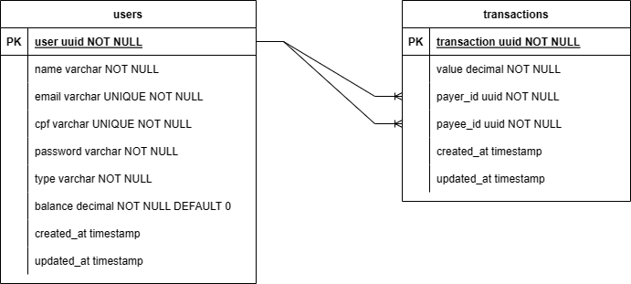

# Documentação do Projeto - Zago Bank

## Introdução

Zago Bank é um Sistema de Transações e é um aplicativo web desenvolvido em Laravel, que permite aos usuários realizar transações financeiras, como depósitos e transferências. Ele fornece uma API para gerenciar usuários e transações.

O projeto também está implantado no seguinte link: [https://zagobank.onrender.com](https://zagobank.onrender.com).

## Requisitos do Sistema

Para executar o Zago Bank em sua máquina local, você deve atender aos seguintes requisitos:

- Docker: O projeto utiliza contêineres Docker para ambiente de desenvolvimento.
- Composer: Uma ferramenta de gerenciamento de dependências para PHP.
- MySQL: Um servidor de banco de dados MySQL.
- PHP: PHP 8.0 ou superior.

## Clonagem do Projeto

Para clonar o projeto e configurá-lo em sua máquina, siga os passos abaixo:

1. Clone o repositório do projeto:
   ```bash
   git clone https://github.com/seu-usuario/sistema-de-transacoes.git
   cd sistema-de-transacoes
   ```

2. Copie o arquivo `.env.example` e renomeie-o para `.env`. Você pode personalizar as configurações do ambiente editando este arquivo.
   ```bash
   cp .env.example .env
   ```

3. Configure o arquivo `.env` com as seguintes informações (ou outros valores desejados):

   ```dotenv
   DB_CONNECTION=mysql
   DB_HOST=mysql - padrão
   DB_PORT=3306 - padrão
   DB_DATABASE=nome da database
   DB_USERNAME=nome do usuario 
   DB_PASSWORD=sua senha aqui
   ```

4. Instale as dependências PHP usando o Composer:
   ```bash
   composer install
   ```

5. Gere uma chave de aplicação:
   ```bash
   php artisan key:generate
   ```

6. Crie o banco de dados no MySQL, conforme configurado no arquivo `.env`.

7. Inicie o ambiente Docker com o comando:
   ```bash
   docker-compose up -d
   ```

8. Entre no container Docker do Laravel:
   ```bash
   docker exec -it nome_do_container-laravel.test-1 /bin/sh
   ```

9. Execute as migrações para criar as tabelas no banco de dados:
   ```bash
   php artisan migrate
   ```

## Estrutura do Projeto

O projeto está estruturado da seguinte forma:

- **app**: Contém a lógica do aplicativo, como controladores, middleware e modelos.
- **config**: Armazena arquivos de configuração, como configurações de banco de dados.
- **database**: Contém migrações e semeadores do banco de dados.
- **public**: A pasta pública onde os recursos públicos, como imagens e arquivos JavaScript, são armazenados.
- **resources**: Recursos front-end, como visualizações Blade e arquivos JavaScript.
- **routes**: Define rotas da API e rotas da web.
- **storage**: Armazena arquivos gerados pelo aplicativo, como registros de log.
- **tests**: Diretório de testes.
- **vendor**: Dependências instaladas pelo Composer.
- **.dockerignore**: Lista de arquivos e pastas que serão ignorados nos contêineres Docker.
- **.env**: Arquivo de configuração do ambiente.
- **docker-compose.yml**: Configuração do ambiente Docker.
- **Dockerfile**: Configuração para a criação da imagem Docker do aplicativo.
- **README.md**: Este documento.

## API Endpoints

O projeto define os seguintes endpoints da API:

- `POST /api/auth/login`: Rota de autenticação.
- `POST /api/users`: Rota para criar usuários.
- `POST /api/users/{id}/deposits`: Rota para realizar depósitos.
- `POST /api/transactions`: Rota para criar transações.

## Diagrama de Banco de Dados

O projeto utiliza um banco de dados MySQL com duas tabelas principais: `users` (usuários) e `transactions` (transações). Você pode consultar os arquivos de migração no diretório `database/migrations` para obter detalhes sobre a estrutura do banco de dados.

## Diagrama




O diagrama acima ilustra o fluxo de caixa do sistema e como as transações entre usuários são registradas no banco de dados.

## Observações

- Os detalhes sobre as tabelas de banco de dados e os modelos associados podem ser encontrados nos arquivos de migração e nos modelos no diretório `app/Models`.
- As configurações de autenticação JWT estão definidas no arquivo `.env`, incluindo a chave JWT (JWT_SECRET).
- O projeto usa Laravel Sail para um ambiente de desenvolvimento Dockerizado, que simplifica a configuração do ambiente.
- Lembre-se de que a configuração do Docker pode variar dependendo do sistema operacional e das ferramentas utilizadas.

Isso conclui a documentação do projeto Sistema de Transações. Agora você pode começar a usar o aplicativo e desenvolver recursos adicionais, se necessário. Certifique-se de consultar a documentação oficial do Laravel e do Docker para obter mais informações sobre essas tecnologias.
